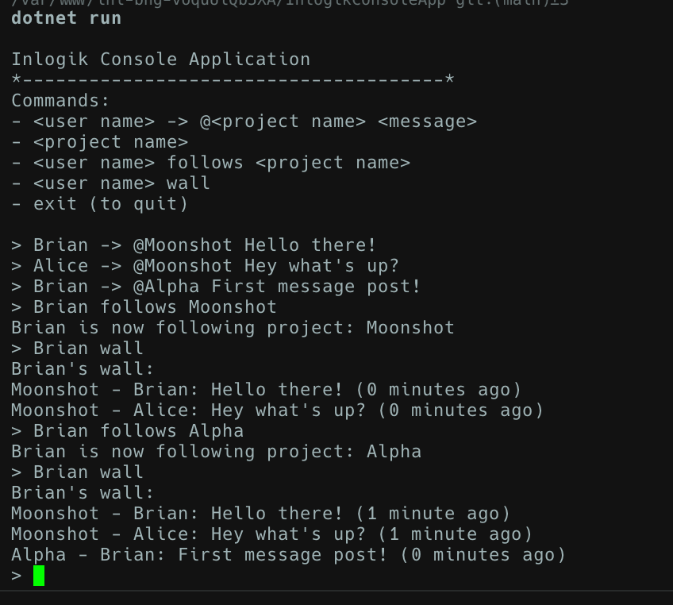

# InlogikConsoleApp

This is a demo of a Inlogik Console App, that demonstrates how message boards work based on the general requirements below.



## General requirements

1. Application must be a C# console application only using .Net 6+ (no web/database)
1. User submits commands to the application:
   - posting: [user name] -> @[project name] [message]
   - reading: [project name]
   - following: [user name] follows [project name]
   - wall: [user name] wall
1. Don't worry about handling any exceptions or invalid commands. Assume that the user will always type
   the correct commands. Just focus on the sunny day scenarios.
1. NOTE: "posting:", "reading:", "following:" and "wall:" are not part of the command. All commands start
   with the user name, except for reading which starts with the project name.
1. IMPORTANT: Implement the requirements focusing on writing the best code you can produce
   implementing CQRS and SOLID principles.

> IMPORTANT: Implement the requirements focusing on writing the best code you can produce implementing CQRS and SOLID principles

## Getting started

Run `dotnet new console -f net6.0 -n InlogikConsoleApp`.

> See https://dotnet.microsoft.com/en-us/download/dotnet/6.0, for .Net 6.0 SDK download (EOL, `6.0.36`).

## Running the console application

```bash
cd InlogikConsoleApp && dotnet build
cd InlogikConsoleApp && dotnet run
```

## Developer notes

- There minor issues still present in better handling of Program runtime. Thus, plenty of room for improvements.
- Follow the TODO comments for code author notes.
- Single-responsibility design principle was only implemented in this demo console app. And implement more such Liskov etc, when possible - it's good learnings to attempt.
- Unit testing should be considered, learn more about `xunit` for providing 100% code coverage on this demo console app.

## References

The online references I used to better understand CQRS pattern and other materials related to C# refreshers.

1. CQRS pattern - https://learn.microsoft.com/en-us/azure/architecture/patterns/cqrs
2. CQRS pattern in C# & Clean Architecture - https://www.codeproject.com/Articles/5377617/CQRS-Pattern-in-Csharp-and-Clean-Architecture-A-Si
3. Datetime nuget package - https://nodatime.org/
4. C# Naming Conventions Cheatsheet - https://cheatography.com/gregfinzer/cheat-sheets/c-naming-conventions/
